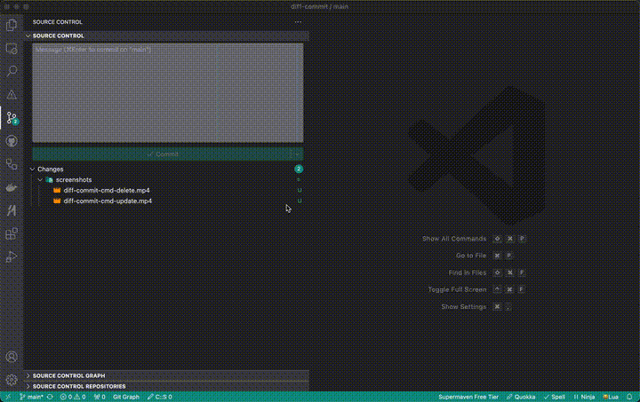
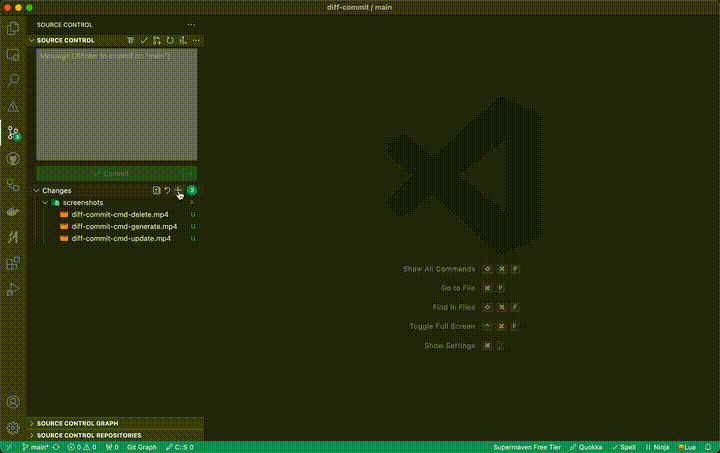
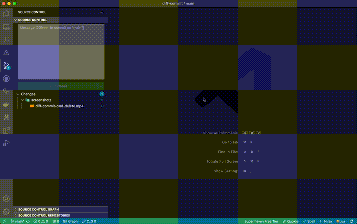
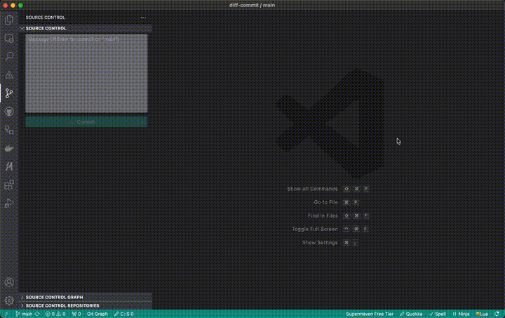

# Diff Commit

Diff Commit is a VSCode extension that helps you generate commit messages following the conventional commits specification using AI models. Choose between Anthropic's cloud-based models like Claude 4 Sonnet or local Ollama models for offline usage. Commit messages are generated using the diff of staged changes and entered directly into the SCM message input or previewed in a new editor window.

The generated commit messages are compatible with [googleapis/release-please](https://github.com/googleapis/release-please) and other tools that use conventional commits.

## Table of Contents

- [Diff Commit](#diff-commit)
  - [Table of Contents](#table-of-contents)
  - [Features](#features)
  - [Requirements](#requirements)
  - [Installation](#installation)
  - [Typical Workflow](#typical-workflow)
  - [Commands](#commands)
    - [`DiffCommit: Generate Commit Message`](#diffcommit-generate-commit-message)
    - [`DiffCommit: Preview Commit Message`](#diffcommit-preview-commit-message)
    - [`DiffCommit: Update API Key`](#diffcommit-update-api-key)
    - [`DiffCommit: Delete API Key`](#diffcommit-delete-api-key)
    - [`DiffCommit: Configure Ollama Model`](#diffcommit-configure-ollama-model)
    - [`DiffCommit: Change Ollama Model`](#diffcommit-change-ollama-model)
  - [Configuration](#configuration)
    - [`diffCommit.provider`](#diffcommitprovider)
    - [`diffCommit.allowedTypes`](#diffcommitallowedtypes)
    - [`diffCommit.customInstructions`](#diffcommitcustominstructions)
    - [`diffCommit.model`](#diffcommitmodel)
    - [`diffCommit.ollamaHostname`](#diffcommitollamahostname)
    - [`diffCommit.ollamaModel`](#diffcommitollamamodel)
    - [`diffCommit.maxTokens`](#diffcommitmaxtokens)
    - [`diffCommit.temperature`](#diffcommittemperature)
  - [Error Handling](#error-handling)
  - [Contributing](#contributing)
    - [Local Development](#local-development)
    - [Local Testing](#local-testing)
  - [License](#license)

## Features

- **Dual Provider Support**: Choose between Anthropic's cloud-based models or local Ollama models for offline usage
- Generate commit messages based on the diff of staged changes using AI models
- **Anthropic Integration**: Access to Claude 4 Sonnet and other powerful cloud models with an API key
- **Ollama Integration**: Use local models for complete offline functionality and privacy
- Preview and edit generated commit messages before applying the commit
- Uses markdown formatting for commit messages
- Implements conventional commit format with type, scope, subject, and body
- Real-time progress notifications during commit message generation
- Seamless integration with VSCode's Source Control Management (SCM)

## Requirements

- VSCode 1.93.1 or higher
- Git installed and configured in your workspace

**For Anthropic Provider:**
- An [Anthropic API key](https://console.anthropic.com/settings/keys)

**For Ollama Provider:**
- [Ollama](https://ollama.com/) installed and running locally
- At least one model pulled (eg `ollama pull llama3.2` or `ollama pull mistral`)

## Installation

Install the extension directly from the [Visual Studio Code Marketplace](https://marketplace.visualstudio.com/items?itemName=tpsTech.diff-commit) or:

1. Open VSCode
2. Press <kbd>Cmd</kbd>/<kbd>Ctrl</kbd> + <kbd>P</kbd>
3. Type `ext install tpsTech.diff-commit`

## Typical Workflow

1. **Choose your provider** (first-time setup):
   - For **Anthropic**: Set up your API key using "DiffCommit: Update stored API Key"
   - For **Ollama**: Configure your local model using "DiffCommit: Configure Ollama Model"
2. Stage the changes that you wish to commit as normal
3. Run the command: "DiffCommit: Generate Commit Message" (<kbd>Cmd</kbd>/<kbd>Ctrl</kbd> + <kbd>K</kbd> → <kbd>Cmd</kbd>/<kbd>Ctrl</kbd> + <kbd>G</kbd>)
4. Monitor progress in the notification area as the extension:
   - Retrieves the git diff
   - Validates your configuration (API key or Ollama connection)
   - Generates the commit message
5. Review the generated message in the Source Control message input
6. Click 'Commit' to commit the changes with the generated message

## Commands

DiffCommit commands can be accessed from the Command Palette (<kbd>Cmd</kbd>/<kbd>Ctrl</kbd> + <kbd>Shift</kbd> + <kbd>P</kbd>) or using the default keyboard shortcuts.

> [!TIP]
> You can reduce token use by staging only part of a group of changes, generating the commit message, then adding the remaining files before committing.

### `DiffCommit: Generate Commit Message`

This will generate a commit message for staged changes and enter it in the Source Control message input box. You can preview and edit the generated message before committing. Progress is shown through notifications as the extension works.

| **Platform** | **Keyboard Shortcut**                                           |
| :----------- | :-------------------------------------------------------------- |
| macOS        | <kbd>Cmd</kbd> + <kbd>K</kbd> → <kbd>Cmd</kbd> + <kbd>G</kbd>   |
| Linux        | <kbd>Ctrl</kbd> + <kbd>K</kbd> → <kbd>Ctrl</kbd> + <kbd>G</kbd> |
| Windows      | <kbd>Ctrl</kbd> + <kbd>K</kbd> → <kbd>Ctrl</kbd> + <kbd>G</kbd> |

### `DiffCommit: Preview Commit Message`

This will generate a commit message for staged changes and open it in a new editor window. You can preview and edit the generated message before committing.

| **Platform** | **Keyboard Shortcut**                                           |
| :----------- | :-------------------------------------------------------------- |
| macOS        | <kbd>Cmd</kbd> + <kbd>K</kbd> → <kbd>Cmd</kbd> + <kbd>P</kbd>   |
| Linux        | <kbd>Ctrl</kbd> + <kbd>K</kbd> → <kbd>Ctrl</kbd> + <kbd>P</kbd> |
| Windows      | <kbd>Ctrl</kbd> + <kbd>K</kbd> → <kbd>Ctrl</kbd> + <kbd>P</kbd> |

### `DiffCommit: Update API Key`

This will update the Anthropic API key used for API access.

1. Enter your API key when prompted
2. Press <kbd>Enter</kbd> to confirm or <kbd>Esc</kbd> to cancel

### `DiffCommit: Delete API Key`

This will delete the stored API key from your system and prevent DiffCommit from accessing the API in the future.

### `DiffCommit: Configure Ollama Model`

This command allows you to set up Ollama as your provider for the first time or switch from Anthropic to Ollama. It will:

1. Prompt you to enter the Ollama server hostname (defaults to `http://localhost:11434`)
2. Test the connection to your Ollama server
3. Display available models for selection
4. Set the provider to Ollama and save your configuration

> [!NOTE]
> Before using this command, ensure that:
> - Ollama is installed and running on your system
> - You have pulled at least one model (eg `ollama pull llama3.2`)

### `DiffCommit: Change Ollama Model`

This command allows you to change your currently selected Ollama model without changing the hostname. It will:

1. Connect to your configured Ollama server
2. Display available models for selection
3. Update your model configuration

> [!TIP]
> Use this command when you want to try a different local model or have pulled new models to your Ollama installation.

## Configuration

DiffCommit provides the following settings to customise its behavior.

### `diffCommit.provider`

Choose the AI provider for generating commit messages. You can use either Anthropic's cloud-based models or local Ollama models.

| **Type** | **Options** | **Default Value** |
| :------- | :---------- | :---------------- |
| enum     | "anthropic" | "anthropic"       |
|          | "ollama"    |                   |

- **"anthropic"**: Use Anthropic's Claude models (requires API key and internet connection)
- **"ollama"**: Use local Ollama models (requires Ollama server to be running, works offline)

> [!TIP]
> Use **Anthropic** for the most advanced language understanding and consistency, or **Ollama** for complete privacy and offline functionality.

### `diffCommit.allowedTypes`

A list of allowed commit types. If provided, this replaces the default options. You need to ensure all required commit types are included in the list.

| **Type**       | **Description**                                                   | **Default Value**                                                             |
| :------------- | :---------------------------------------------------------------- | :---------------------------------------------------------------------------- |
| Array\<string> | A list (array) of any string/s you want available as commit types | [ "chore", "ci", "docs", "feat", "fix", "perf", "refactor", "style", "test" ] |

> [!WARNING]
> Changing the default, replaces the option value. If you set this option, be sure to include a complete list of all required commit types.

### `diffCommit.customInstructions`

Add additional custom instructions to the commit generation prompt. Useful for providing context or specific requirements like 'Use Australian English spelling'.

| **Type** | **Description**                                                                       | **Default Value** |
| :------- | :------------------------------------------------------------------------------------ | :---------------: |
| string   | Free formatted string that you want included as custom instructions for the AI prompt |        ""         |

### `diffCommit.model`

The Anthropic AI model to use for generating commit messages. This setting is only used when the provider is set to "anthropic".

| **Type** | **Options**                | **Default Value**   |
| :------- | :------------------------- | :------------------ |
| enum     | "claude-sonnet-4-0"        | "claude-sonnet-4-0" |
|          | "claude-3-7-sonnet-latest" |                     |
|          | "claude-3-5-sonnet-latest" |                     |
|          | "claude-3-5-haiku-latest"  |                     |
|          | "claude-opus-4-0"          |                     |
|          | "claude-3-opus-latest"     |                     |

### `diffCommit.ollamaHostname`

The URL of the local Ollama server. This setting is only used when the provider is set to "ollama".

| **Type** | **Description**                                      | **Default Value**        |
| :------- | :--------------------------------------------------- | :----------------------- |
| string   | The hostname URL where your Ollama server is running | "http://localhost:11434" |

> [!NOTE]
> Most users won't need to change this unless running Ollama on a different port or remote server.

### `diffCommit.ollamaModel`

The Ollama model to use for generating commit messages. This setting is only used when the provider is set to "ollama".

| **Type** | **Description**                                                         | **Default Value** |
| :------- | :---------------------------------------------------------------------- | :---------------- |
| string   | The name of the Ollama model (e.g., "llama3.2", "mistral", "codellama") | ""                |

> [!TIP]
> Use the "DiffCommit: Configure Ollama Model" command to easily set this up. Popular models for code tasks include:
> - **llama3.2**: General-purpose model with good reasoning
> - **mistral**: Fast and efficient for most tasks  
> - **codellama**: Specialised for code-related tasks

### `diffCommit.maxTokens`

Maximum number of tokens to generate in the response. Higher values allow for longer commit messages but use more API tokens.

| **Type** | **Minimum** | **Maximum** | **Default Value** |
| :------- | :---------: | :---------: | :---------------: |
| number   |      1      |    8192     |       1024        |

### `diffCommit.temperature`

Controls randomness in the response. Lower values (like 0.3) produce more focused and consistent commit messages, while higher values introduce more variety.

> [!TIP]
> For concise, focused & repeatable commit messages, use a value in the range of 0.1 to 0.4.
> 
> If you want a little more creativity or more room for the AI model to interpret the reason for changes, try a higher value like 0.7.

| **Type** | **Minimum** | **Maximum** | **Default Value** |
| :------- | :---------: | :---------: | :---------------: |
| number   |      0      |      1      |        0.3        |

## Error Handling

Diff Commit provides clear feedback for various scenarios to help troubleshoot issues. Here are the common messages you might encounter:

|                           | **Error**                                                                        | **Description**                                               |
| :------------------------ | :------------------------------------------------------------------------------- | :------------------------------------------------------------ |
| **Git Related**           | Git extension not found in VSCode                                                | VSCode's Git extension is not installed or enabled            |
|                           | No Git repository found in the current workspace                                 | The current workspace is not a Git repository                 |
|                           | No workspace folder found                                                        | No workspace is open in VSCode                                |
|                           | No changes detected                                                              | No staged changes found to generate a commit message for      |
| **API Key Related**       | API key is missing or not provided                                               | No API key has been set for Anthropic provider                |
|                           | Invalid API key format (should start with sk-ant-api)                            | The provided API key doesn't match the expected format        |
|                           | Failed to access or update secure storage                                        | Unable to store or retrieve the API key from secure storage   |
| **Anthropic API Errors**  | Bad Request: Review your prompt and try again                                    | Invalid request to the Anthropic API (400)                    |
|                           | Unauthorized: Invalid API key, update your API key and try again                 | The API key is invalid or expired (401)                       |
|                           | Forbidden: Permission denied, update your API key and try again                  | The API key doesn't have permission for this operation (403)  |
|                           | Rate Limited: Too many requests, try again later                                 | You've exceeded your API rate limit (429)                     |
|                           | Server Error: Anthropic API server error                                         | An error occurred on Anthropic's servers (500)                |
|                           | Server Error: Anthropic Server Overloaded                                        | The Anthropic API server is overloaded (529)                  |
| **Ollama Related Errors** | Unable to connect to Ollama server                                               | Ollama server is not running or not accessible                |
|                           | Ollama server not found                                                          | Invalid hostname or Ollama is not installed                   |
|                           | No Ollama model selected. Please configure an Ollama model first                 | No Ollama model has been configured for the extension         |
|                           | Ollama model not specified                                                       | No Ollama model has been configured or selected               |
|                           | Model '[model-name]' not found. Please check if the model is available in Ollama | The specified model is not available in Ollama                |
|                           | No models found on the Ollama server                                             | No models have been pulled to the Ollama installation         |
|                           | Invalid hostname URL                                                             | The provided Ollama hostname is not a valid URL               |
|                           | Ollama server error                                                              | An error occurred on the Ollama server (500)                  |
| **Other Errors**          | Failed to write commit message to Source Control                                 | Unable to update the SCM input box with the generated message |
|                           | Failed to open commit message preview                                            | Unable to open the preview editor                             |
|                           | No commit message was generated by the API                                       | The API response didn't contain a valid commit message        |

Each error includes specific guidance on how to resolve the issue. For persistent problems, please check your configuration and if appropriate, raise an issue on [GitHub](https://github.com/tsdevau/diff-commit/issues).

## Contributing

Feature requests, suggestions and contributions to Diff Commit are welcome! Please feel free to submit an idea or Pull Request.

### Local Development

1. Clone the [repository](https://github.com/tsdevau/diff-commit)
2. Install dependencies: `pnpm install`
3. Build the extension: `pnpm compile`
4. Run the tests: `pnpm test`

### Local Testing

1. Press F5 (<kbd>Cmd</kbd>/<kbd>Ctrl</kbd> + <kbd>Shift</kbd> + <kbd>P</kbd> and select `Debug: Start Debugging`) to start the debugger
2. This will open a new VSCode window with the extension loaded
3. Make changes to files and use the source control panel to test the extension

## License

This project is licensed under the MIT License.
